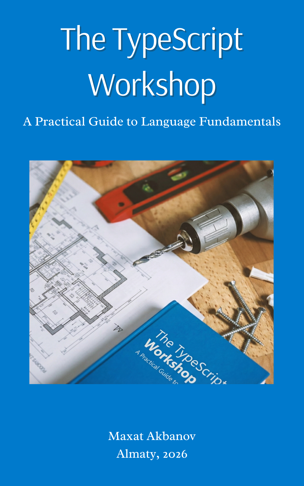

# The TypeScript Workshop: A Practical Guide to Language Fundamentals

This repository serves as the official companion resource for the book. It provides a comprehensive, structured collection of all practical exercises detailed within the book. 

👉 For more books and practical tutorials, visit [maxat-akbanov.com](https://maxat-akbanov.com/)

## Exercises
- [The Compiler](./compiler/)
